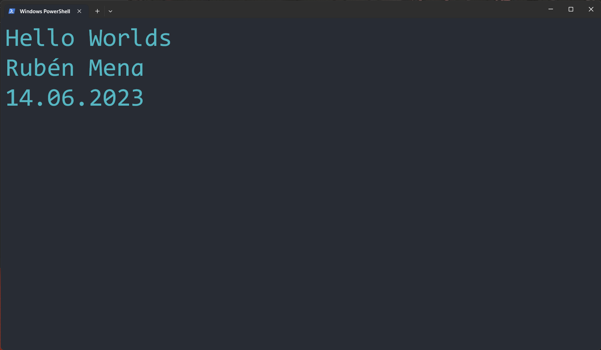
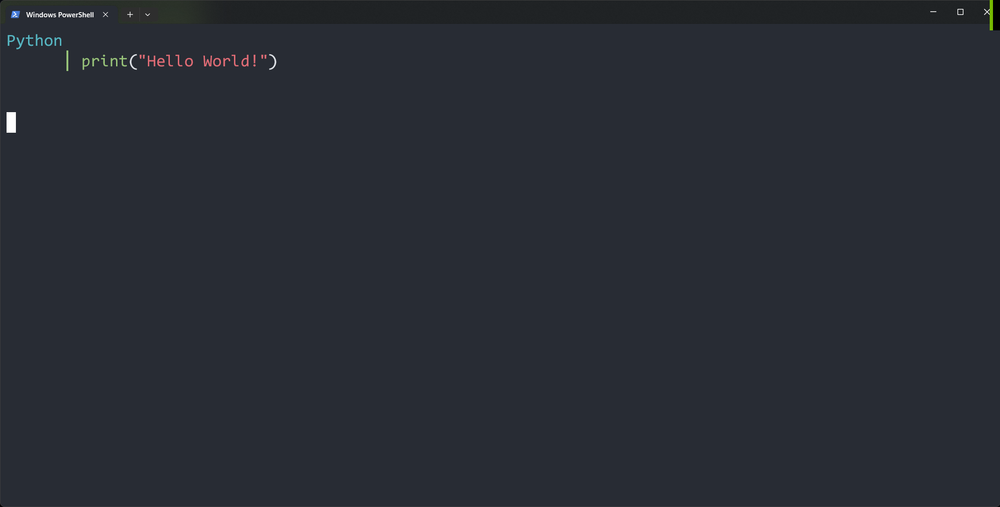
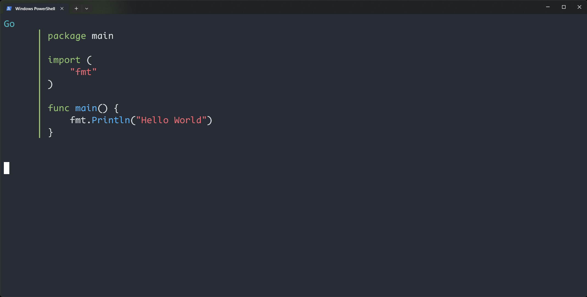
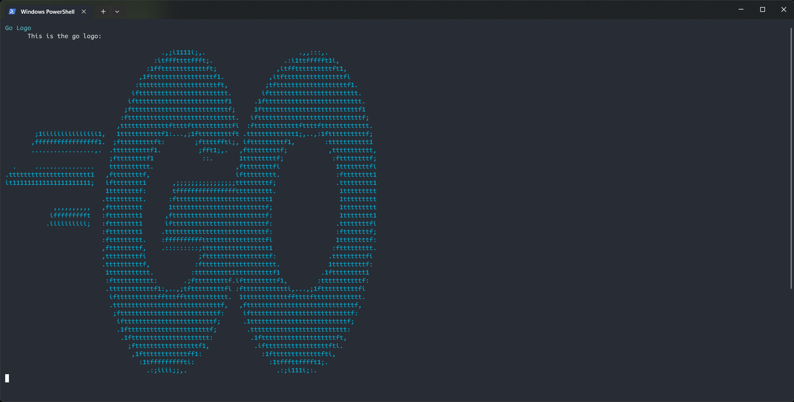
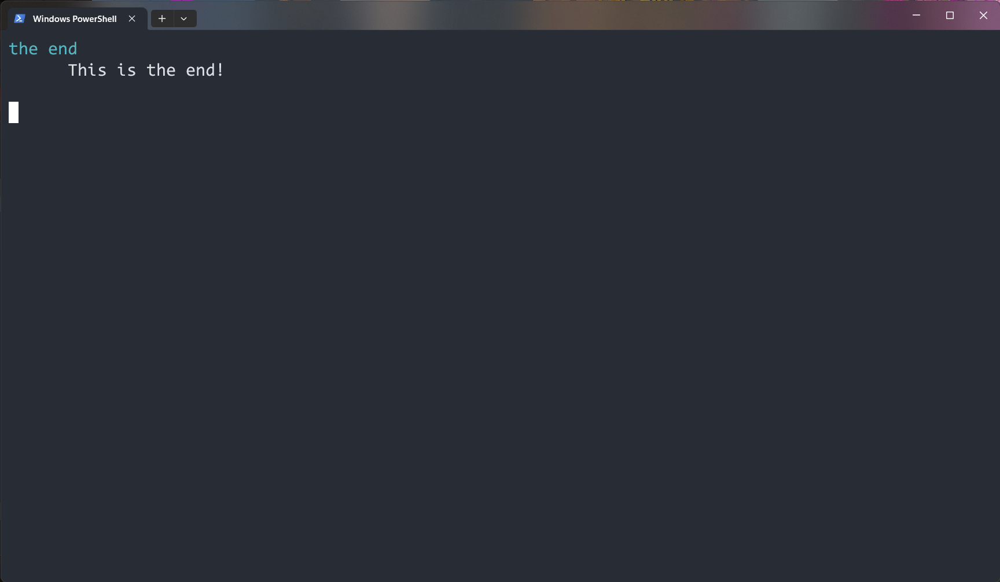

# go-mdp
convert markdown files to presentations inside your terminal! (unfinished)

# Usage
```
go run gomdp.go --path sample.md
```

Now you can use the left and right arrow keys to move to the next or previous slide. Our `sample.md` presentation
should looke like this:

> **_INFO:_** You can navigate through the presentation using your left and right arrow keys. Press 'q' to quit. Images get converted into colored ASCII art










