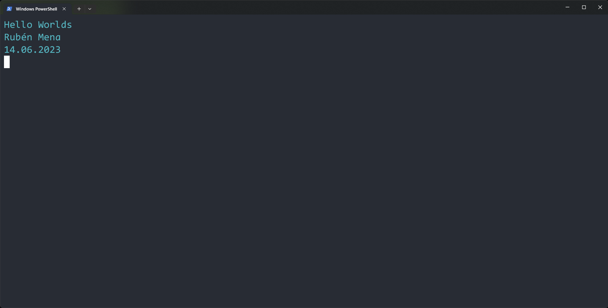
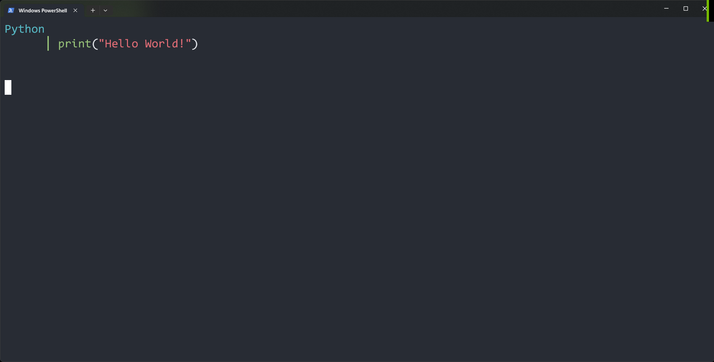
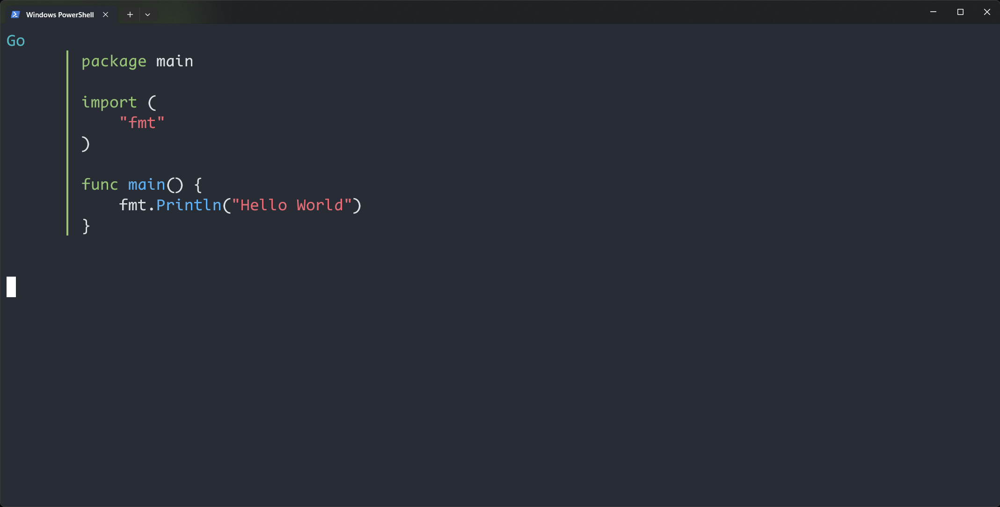
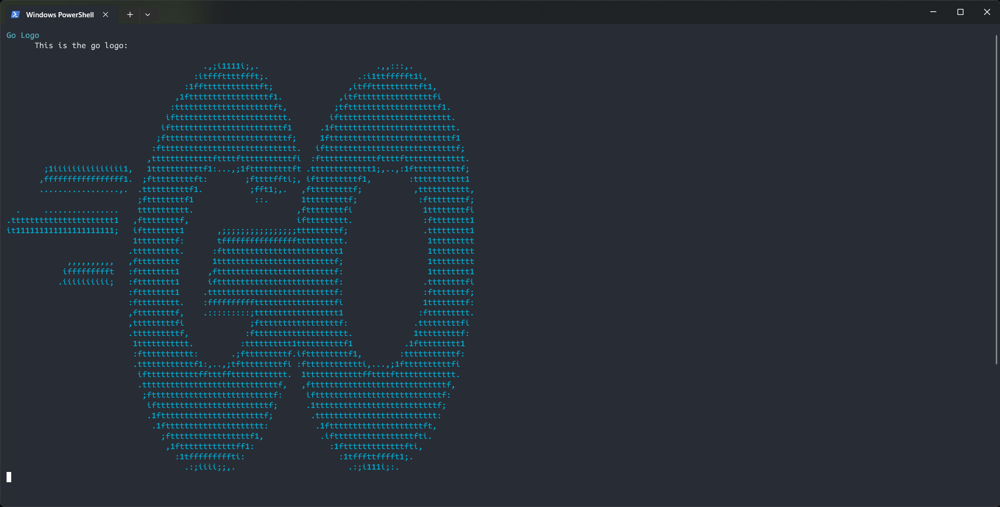
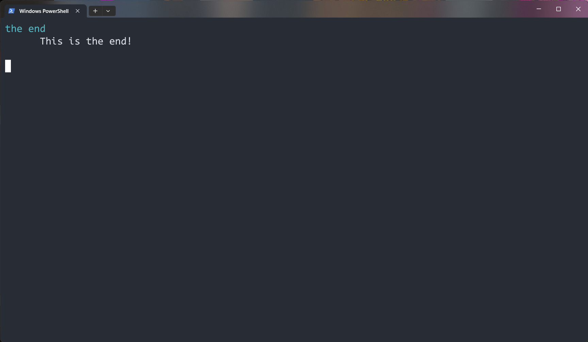

# go-mdp
convert markdown files to presentations inside your terminal! (unfinished)

# Usage
```
go run gomdp.go --path sample.md
```

Now you can use the left and right arrow keys to move to the next or previous slide. Our `sample.md` presentation
should looke like this:

> **_INFO:_** You can navigate through the presentation using your left and right arrow keys. Press 'q' to quit. Images get converted into colored ASCII art











# future feature ideas
The kitty terminal has introduced something called [the kitty graphics protocol](https://sw.kovidgoyal.net/kitty/graphics-protocol/) which allows us
to render images in our terminal! We are currently showing all images as "ascii art". The idea is that go-mdp will be able to render images inside the terminal
instead of converting them to ascii (if you're terminal supports that of course!).